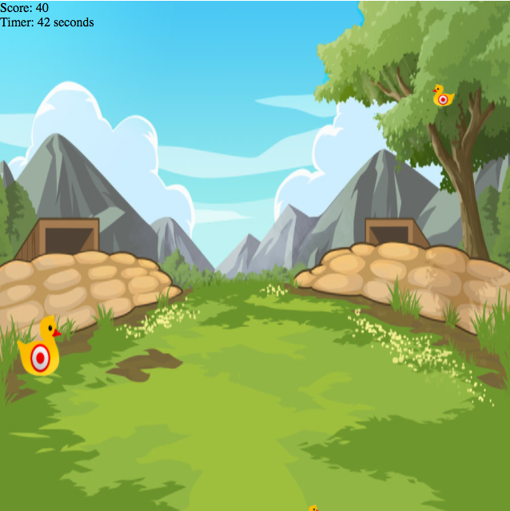

# Project-1-Point-and-click-game

###Introduction
This is my work for the first project given to us which was to create a browser game. My game is a point and click shooting gallery.

###How to run
You can either download the repository and open the index.html file to run the game. Or access it online via github by clicking on this link [here] (https://leebury.github.io/Project-1-Point-and-click-game/)

###The Game
The game itself is very simple, The point is to try and score as many points as possible in 60 seconds, The larger ducks are worth 20 points while the smaller targets are worth 10 points. 

The ducks will appear randomly on the edge of the screen and will vanish once clicked, There's a 'Quack' sound effect to confirm if a duck has been hit.

###Technologies used
This project was done using html, css, javascript and Jquery.

###Further work
Continuing on from this i'd like to add a few more features to polish this game off properly, Such as a level system which increases the speed of the targets as well as the points awarded per target.

Fully implement the leaderboard to store the scores and add them into a top 5.